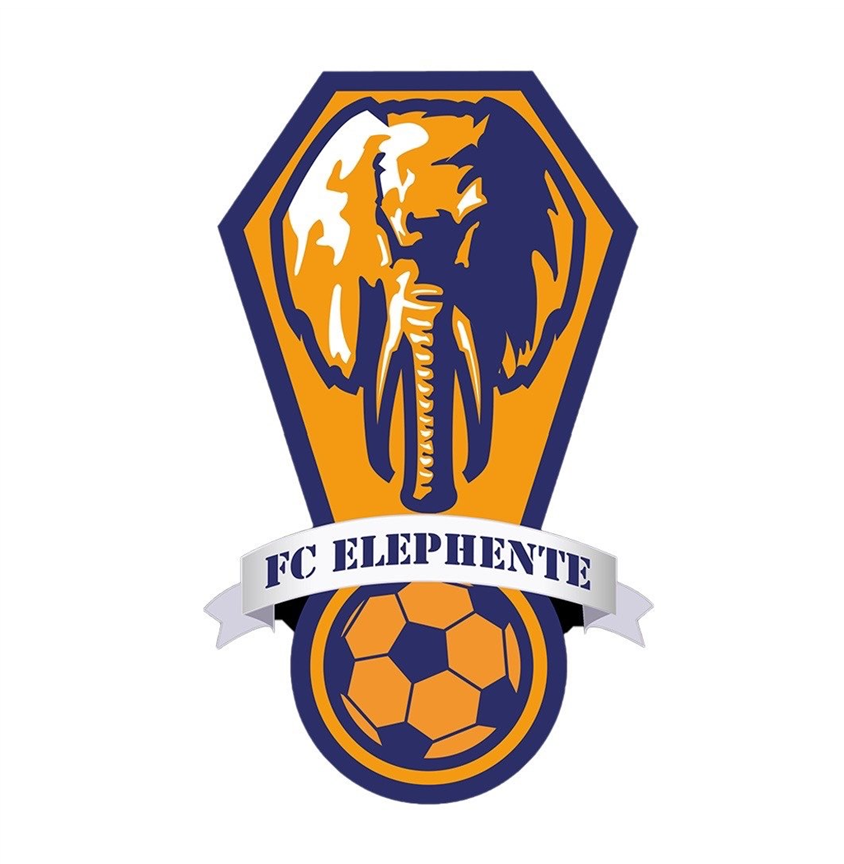
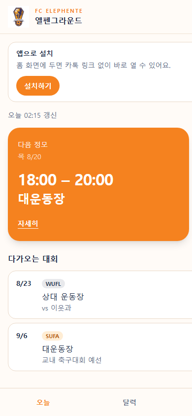
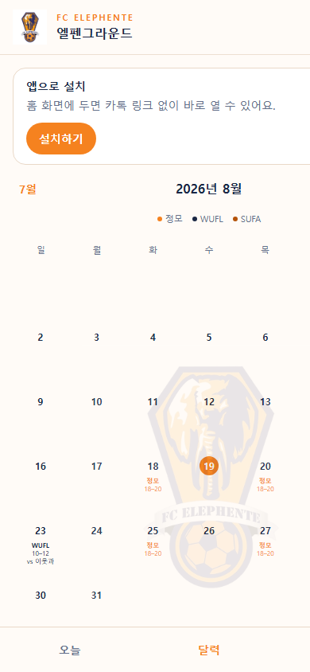
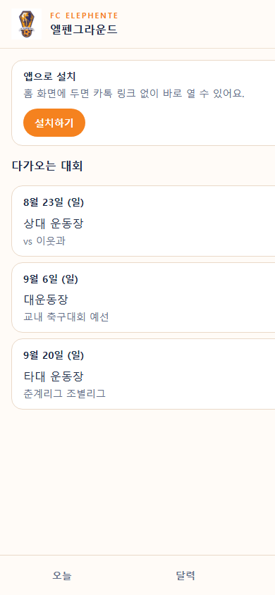

<!-- ① 표지 · 10초 -->

# 엘펜그라운드

엘펜 부원이 톡방에 흩어진 일정을,
**한 링크에서** 본다

조정빈 · FC ELEPHENTE

---

<!-- ② 문제 · 30초 · 페르소나 -->

## 오늘 어디야?

2학년 김민재. 수업이 끝나 운동장에 갔는데, **오늘은 다른 구장**이었다.

톡은 쌓여 있고, 공지는 찾기 싫다.
그래서 동기에게 또 묻는다. *“오늘 어디야?”*

---

<!-- ③ 해결 · 20초 · Must -->

## 열자마자 오늘이 보이게

Must는 **오늘 카드** 하나다.

링크만 열면 다음 정모의 **시간·장소**가 맨 위.
가입도, 알림도 없다. 헛걸음이 여기서 끝난다.

---

<!-- ④ 데모 · 60초 -->

## 오늘 · 달력 · 대회

---

<!-- ⑤ 기술 · 20초 -->

## 이렇게 만들었다

React
Vite
TypeScript
Tailwind
Supabase
Vercel
PWA

일정은 Supabase, 화면은 Vercel.
고치면 다시 배포하지 않아도 부원 화면에 바로 반영된다.

---

<!-- ⑥ 숫자 · 20초 · 오늘 밤 마케팅 후 기입 -->

## 오늘 밤 숫자로 확인

동아리 톡에 링크를 올리고, GA로 본다.

사용자 <b>　명</b>

유입 <b>톡 링크</b>

반응 <b>　</b>

---

<!-- ⑦ 배운 점 · 15초 -->

## 막힌 곳

달력을 올리면 **날짜가 헤더 글자와 겹쳤다.**
둘 다 같은 레이어에 있어서였다.

헤더를 위로 올리고 배경을 불투명하게 바꿨다.
스크롤해도 이름이 가려지지 않는다.

---

<!-- ⑧ 다음 · 5초 · Won't + QR -->

## 다음은 알림이 아니다

알림·로그인은 안 한다.
홈 화면에 두고, **이 링크로 오늘만** 확인한다.

elephente.vercel.app

